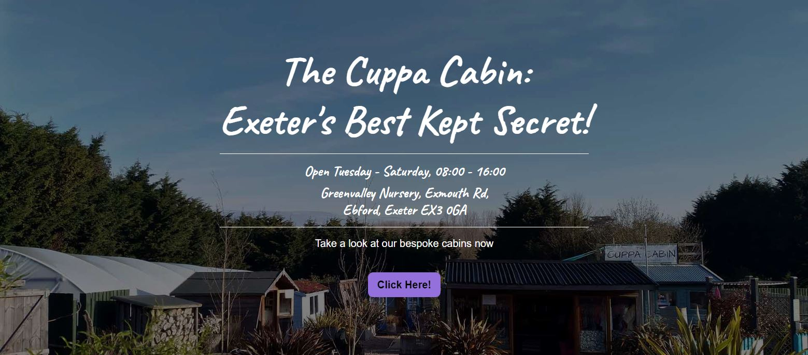
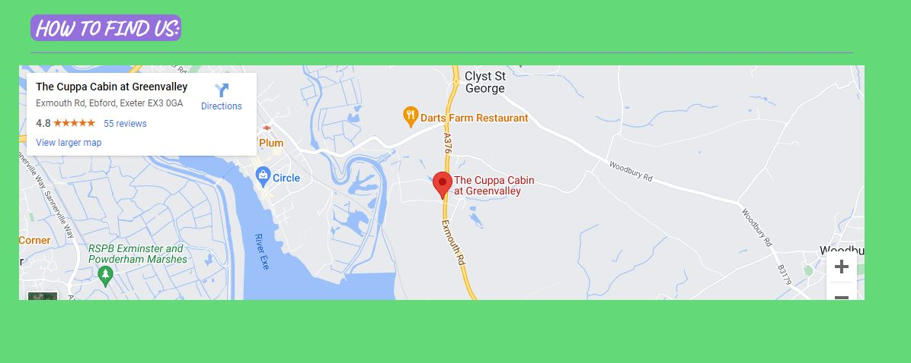
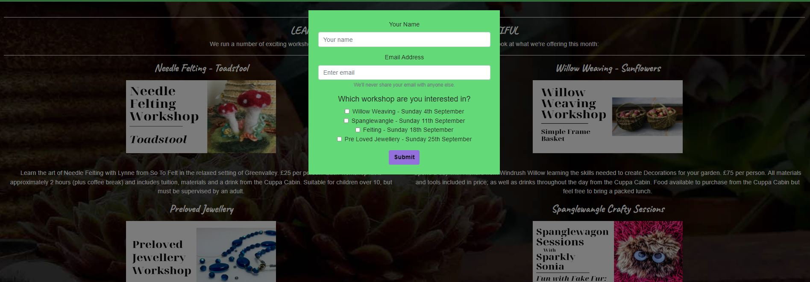
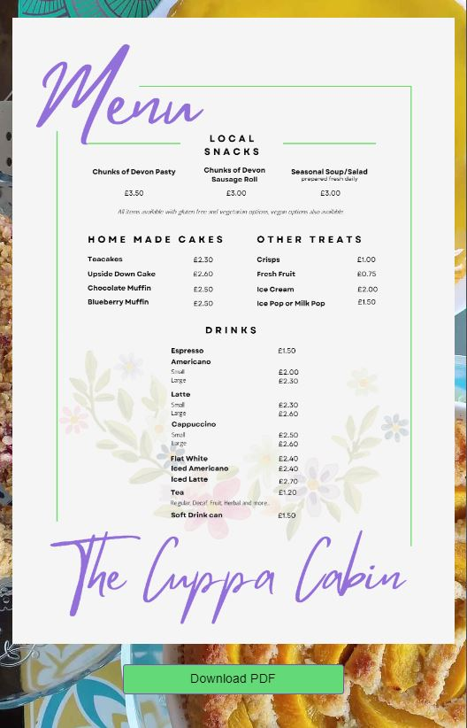

# Portfolio Project 1 - HTML/CSS Essential

The Cuppa Cabin is a website to promote and facilitate the business The Cuppa Cabin, which offers food and drink as well as the rental of cabins to relax in.
This site is intended to bring new customers to the business, but also offer returning customers simple booking options. 
    

## UX
    
### Target Audience

Existing customers, tourists, 

### User Stories

* As a user I would like to ensure my favourite shed is available so that I can enjoy my visit more. 
* As a user I want to be able to enquire about upcoming workshops so that I can save time. 
* As a user I want to be able to contact the business so that I can enquire about dietry options. 
* As a user I want to be able to plan my trip for peace of mind. 
* As a user I want to be able to see what other customers think before deciding to visit. 
* As a user I want to be able to check what food and drink they offer before visiting. 

### Wireframes

The Wireframes were produced using Balsamiq. The final site varies from the wireframes due to developments that occurred during the building process.

#### Home Page

#### Sheds Page

#### Workshop Page

#### Menu Page

#### Contact Page

### Colour Scheme

The colour scheme was requested by the owner of the Cuppa Cabin as they match their existing branding, including loyalty cards
This included an Emerald green as a border, which made up the bulk of the colour used across the site, accented with a Medium Purple,
matching the coffee machine and existing sign at the premises. This was paired with white and black for the text to ensure good contrast. I experimented with adding other colours to try and help accentuate, which began to make the 
layout look untidy. Using only the two primary colours allowed for a bold and clean look, making information very clear. 

### Typography

Google Fonts was used to import the two fonts used accross the website. Caveat was used for headings and links as I was looking for an easy to read cursive or handwritten font. A number of different options were attempted, with many which seemed fitting at desktop view not suitable for viewing on smaller devices. Caveat sat perfectly inbetween seeming handwritten but completely legible at all sizes.  Roboto was selected for the main body text due to its clean design and ease of reading. Allows for the main body text to be clear and understandable accross all pages. 

Font Awesome was used for the footer icons displaying links to Instagram and Facebook. 

## Features

This website has standard features such as a navigational bar and footer, features which internet users will be familiar with. This allows for ease of navigation and comfortable user experience. 

### Home Page

#### Navigational Bar

The navbar for each page is responsive and collapses into a hamburger at mobile screens and horizontal orientation on certain devices. The title is a link to return to the home page and when a page is active, it is displayed in bold for ease of navigation. 

#### Footer

The footer for each page is simple and includes links to the Cuppa Cabin's social media pages on Instagram and Facebook. 

#### Hero Image

The primary use for the home page is to display the basic information for the Cuppa Cabin, including the address and opening hours. This also includes a link to the Sheds page to allow for frequent visitors easy access to the booking modal. 

#### Map

The home page also includes an interactive map imported from Google Maps showing the location of the Cuppa Cabin. This includes the option to view a larger map which opens in a new tab to allow customers to generate directions. 

### Sheds Page

#### Main Body

The main body of the sheds page is used to display an image of each available shed to book and an explaination of the suggested numbers. This is done on a responsive grid system which lays out the information based on the device being used. This is placed on a dark background to match the opaque nature of the hero image for consistency across the site.

#### Booking Modal

The booking modal's content is supplied by SimplyBook's Widget services, this is a live booking service which the Cuppa Cabin currently uses. It allows the visitor to book a time slot for their desired shed with ease. 

### Workshops Page

#### Main Body

The main body of the workshop page is used to display information for the upcoming workshops being ran, including their price. This is done on a responsive grid system which lays out the information based on the device being used. This is placed on a dark background to match the opaque nature of the hero image for consistency across the site.

#### Enquiry Modal

The modal is used for an enquiry form. The form includes checkboxes, allowing the visitor to enquire about multiple workshops at once. 

### Menu Page

This page displays the current menu for the Cuppa Cabin so that visitors can view it before visiting. There is also a download button to allow for the PDF copy to be saved to a device. 

### Contact Page 

The contact page displays a clean contact form to easily enquire about anything in regards to the cuppa cabin. It sits at the end of the links as a natural end to the user journey, in case any of their questions have not been answered by the information displayed. For this project, the submit validates the form only. 

### Features Left to Implement

* Blog.
* Gallery for shed takeover.
* Direct booking for workshops.

## Technologies Used

* [HTML5](https://html.spec.whatwg.org/) - Content and structure.
* [CSS](https://www.w3.org/Style/CSS/Overview.en.html) - Provides styling.
* [Bootstrap 4.5](https://getbootstrap.com/docs/4.5/getting-started/introduction/) - Base structure, layout and design of pages.
* [Google Fonts](https://fonts.google.com/) - Provides both fonts used for site. 
* [Font Awesome](https://fontawesome.com/) - Instagram and Facebook icons for footer. 
* [Gitpod](https://www.gitpod.io/) - Used to create and host the site.
* [Github](https://github.com/) - Used for site deployment
* [Hover.CSS](https://ianlunn.github.io/Hover/) - Provided hover animations for site
* [Chrome Dev Tools](https://developer.chrome.com/docs/devtools/) - used extensively for testing responsiveness, deploying temporary changes to styling and layout. 
* [Google Maps](https://maps.google.com) - Used to embed live map to site. 
* [SimplyBook](https://help.simplybook.me/index.php/Widgets_for_your_own_website) - Booking widget on Sheds page.
* [Am I Responsive?](https://ui.dev/amiresponsive) - Used to generate mockup of Home Page on various devices. 
* [Balsamiq](https://balsamiq.com/) - Used to create the wireframes. 
* [W3C Validation](https://validator.w3.org/) - Used to validate all site code. 
* [Lighthouse](https://web.dev/performance-scoring/) - Used for accessibility and performance checks. 
* [A11y Colour Contrast Checker](https://color.a11y.com/) - Used for colour contrast and accessibility checks. 
* [Photoshop](https://www.adobe.com/uk) - Used for image manipulation.

## Testing

For all testing, please refer to the [TESTING.md](TESTING.md) file.

## Deployment

The site was deployed to GitHub pages.

### Deploy to GitHub Pages

1. Navigate to the settings tab of the GitHub repository.
2. In settings, navigate to the pages tab. 
3. Go to source, select "master" branch and select "save"
4. The page will refresh and display a detailed ribbon indicating deployment. 

### Copy the Repository

1. Access GitHub and locate the repository
2. Click "fork", found on right hand side, to create a copy of the original

### Creating a Local Clone

1. Click on the "Code" dropdown tab
2. This opens the clone box, select the HTTPS tab and click the copy icon
3. Open GitBash
3. Change the current working directory to the desired location of your cloned directory
5. Type "git clone" followed by the URL copied from GitHub
6. Press enter to confirm and create local clone

## Credits

### Content

* Issues were often resolved through [Stack Overflow](https://www.stackoverflow.com), including posts from many helpful forum members. 
* Snippets of code used from [Bootstrap 4.5](https://getbootstrap.com/docs/4.5/getting-started/introduction/)'s documentation for both modals.
* Other issues were resolved by returning to CI lessons and taking inspiration for fixes. 
* Hamburger menu and index.html layout inspired by Whiskey Drop lessons on CI.
* Booking widget supplied by [SimplyBook](https://help.simplybook.me/index.php/Widgets_for_your_own_website). 

### Media

All photos were supplied by Zoe Padfield of the Cuppa Cabin, full permission of use of these images given. 

### Acknowledgements

CI Mentors Tim Nelson and Chris Quinn were invaluable in getting this project to fruition. My fellow students in the Coleg y Cymoedd May 2022 Slack group kept the motivation up and provided a few key reminders. My family and friends for taking the time to check my site on all their devices. Finally, Zoe Padfield for providing the inspiration for the project. 